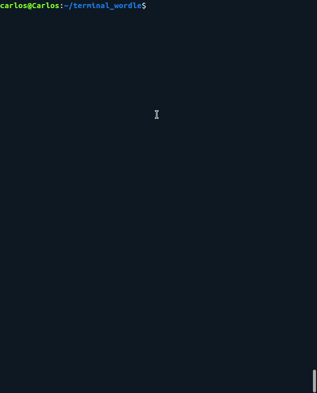

# terminal_wordle README

Terminal adaptation of the popular game Wordle.

---



## How to play?

Once downloaded the code, you only have to compile it with the instruction:

```makefile
make
```

Once compiled, it automatically creates a build folder with an executable file called final_program.

To execute it just type in terminal: 

```makefile
./build/final_program
```

## Dictionary

Currently it’s only available the spanish dictionary but in a near future more languages will be included.

The words used are provided by a list of 2000 of the most common words in spanish which are filtered to keep only the ones with 5 letters (about 600).

[Link to the original list](https://github.com/bitcoin/bips/blob/master/bip-0039/spanish.txt)

## Discalimer

The code of this program wont probably be the most correct and clean code of the world so be carefull when using it because it could be full of bad habits and errors. (like non freeing the dinamically allocated variables, in process of being fixed).

Any kind of feedback is appreciated to keep learning. Thanks :)

---

## ¿Cómo jugar?

Una vez descargado el código, solamente hay que compilarlo mediante la instrucción

```makefile
make
```

Al compilar se crea una carpeta build que inculle el ejecutable con nombre final_program. 

Para ejecutarlo solamente tecleamos en la terminal

```makefile
./build/final_program
```

## Diccionario

Actualmente solamente dispone de un diccionario de palabras en castellano pero en un futuro se implementarán más diccionarios.

Las palabras utilizadas provienen de una lista con 2000 de las palabras más comunes en castellano las cuales se filtran para quedarse solamente con las que tienen 5 letras (600 palabras aproximadamente)

[Link a la lista original de palabras](https://github.com/bitcoin/bips/blob/master/bip-0039/spanish.txt)

## Aviso

Seguramente el código de este programa no sea el más limpio y correcto del mundo por lo que puede estar lleno de errores o malas prácticas.

Se agradece cualquier tipo de feedback para seguir aprendiendo. Gracias :)

## Licencia

---